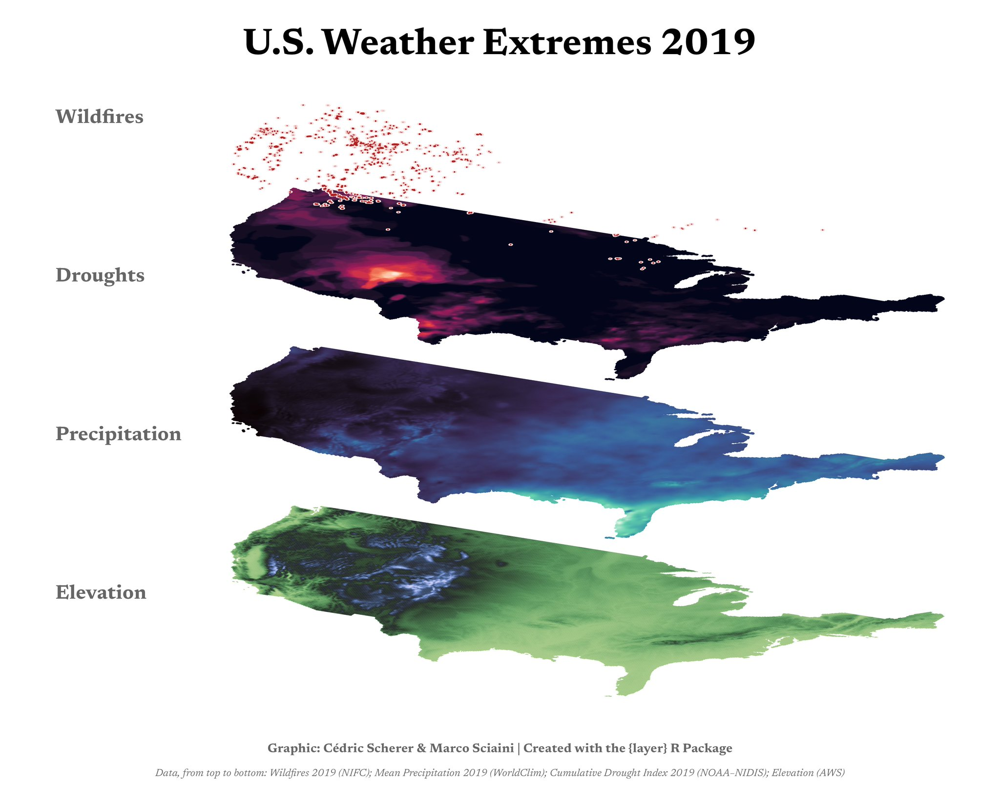
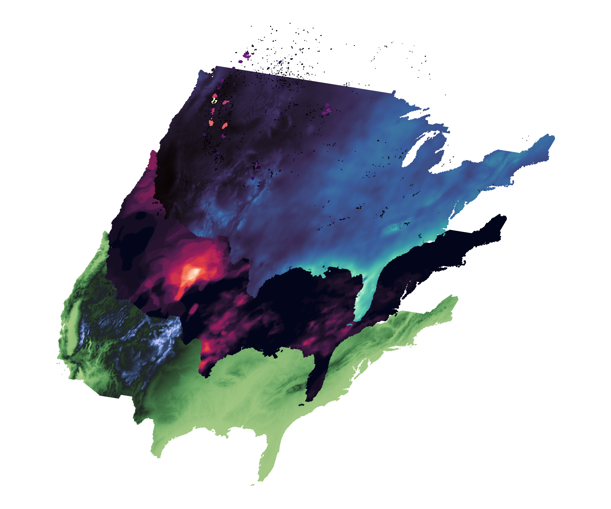

<!-- README.md is generated from README.Rmd. Please edit that file -->

# layer <a></a>

<!-- badges: start -->

[](https://github.com/marcosci/layer/actions?query=workflow%3AR-CMD-check)
[](https://www.repostatus.org/#active)
[](https://cran.r-project.org/web/packages/layer/)
[](https://cran.r-project.org/package=layer)
<!-- badges: end -->

The goal of `layer` is to simplify the whole process of creating stacked
tilted maps, that are often used in scientific publications to show
different environmental layers for a geographical region. Tilting maps
and layering them allows to easily draw visual correlations between
these environmental layers.

Something in the line of:

<!-- -->

## Installation

You can install the development version of layer from
[GitHub](https://github.com/) with:

``` r
# install.packages("devtools")
devtools::install_github("marcosci/layer")
```

## Example

This is a basic example which shows you how to solve a common problem:

``` r
library(layer)

tilt_landscape_1 <- tilt_map(landscape_1)
#> Loading required package: raster
#> Loading required package: sp
tilt_landscape_2 <- tilt_map(landscape_2, x_shift = 50, y_shift = 50)
tilt_landscape_3 <- tilt_map(landscape_3, x_shift = 100, y_shift = 100)
tilt_landscape_points <- tilt_map(landscape_points, x_shift = 150, y_shift = 150)

map_list <- list(tilt_landscape_1, tilt_landscape_2, tilt_landscape_3, tilt_landscape_points)

plot_tiltedmaps(map_list, 
                layer = c("value", "value", "value", NA),
                palette = c("bilbao", "mako", "rocket", "turbo"),
                color = "grey40")
#> Warning in if (is.na(layer)) layer <- "value": the condition has length > 1 and
#> only the first element will be used
```


### More advanced examples

Some more realistic looking data (DEM, drought and precipitation for
continental USA):

``` r
tilt_landscape_1 <- tilt_map(dem_usa, y_tilt = 3)
tilt_landscape_2 <- tilt_map(drought_usa, y_tilt = 3, x_shift = 15, y_shift = 25)
tilt_landscape_3 <- tilt_map(prec_usa,y_tilt = 3,  x_shift = 30, y_shift = 50)
tilt_landscape_4 <- tilt_map(fire_usa,y_tilt = 3, x_shift = 45, y_shift = 65)

map_list <- list(tilt_landscape_1, tilt_landscape_2, tilt_landscape_3, tilt_landscape_4)

plot_tiltedmaps(map_list, palette =c("tofino", "rocket", "mako", "magma"), direction = c(-1, 1, 1, 1)) 
```

<!-- -->
